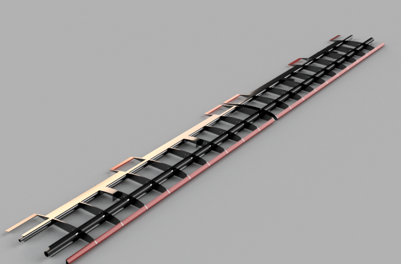
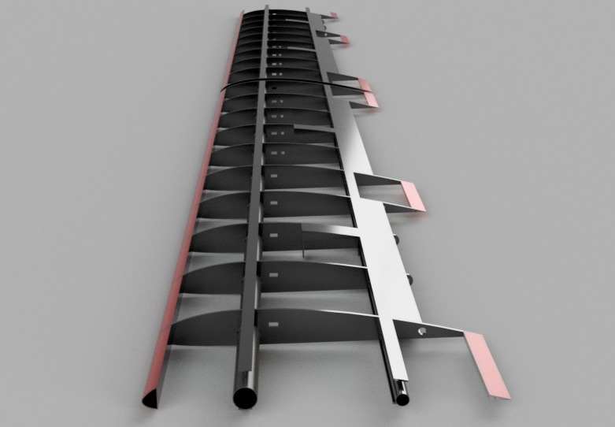
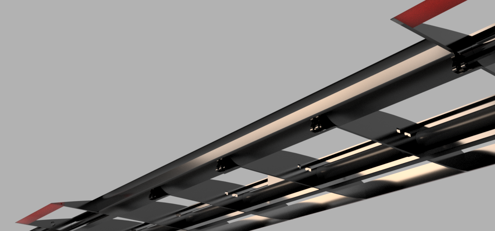
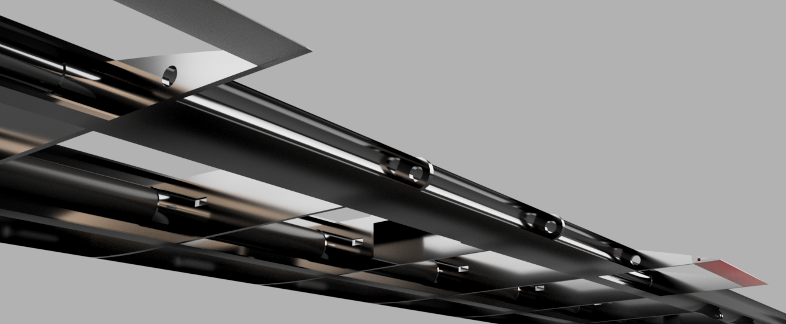

# SkyTitan (HLE-3000) Modular Wing Architecture

  

## Overview
**SkyTitan (HLE-3000)** is a high-performance, modular fixed-wing UAV architecture designed for long-range surveying, aerial mapping, and endurance research missions. The design features a 3-meter wingspan with a **Clark-Y** airfoil, optimized for stability and high lift capacity.

This repository contains the STEP files for the 20-piece modular wing system, featuring a unique interlocking mechanism and a specialized **Slotted Flap** system for superior STOL (Short Take-Off and Landing) capabilities.

> **Design Goal:** To create a cost-effective, printable airframe capable of carrying up to 3kg of payload with a flight endurance of 300-400km (using a 52cc gas engine).

## Technical Specifications

| Parameter | Value |
| :--- | :--- |
| **Wingspan** | 3000 mm (3 Meters) |
| **Chord Length** | 350 mm |
| **Airfoil** | Clark-Y |
| **Construction** | 3D Printed (Modular - 20 Sections) |
| **Est. Wing Weight** | ~1260g (PETG Printed) |
| **Max T.O. Weight (MTOW)** | Up to 15 kg |
| **Payload Capacity** | ~3 kg |
| **Propulsion** | 50cc - 55cc Gas Engine (Recommended) |

## Key Features
*   **Modular Design:** The wing is divided into 20 sections (10 Left / 10 Right) connected via a robust male/female interlocking interface.
*   **Advanced Control Surfaces:** Features a **Slotted Flap** mechanism for high-lift performance during landing and takeoff.
*   **Integrated Avionics Bays:** Dedicated compartments for servos, wiring, and internal antenna placement to reduce drag.
*   **Structural Integrity:** Reinforced with dual carbon fiber spars (Main & Rear).
*   **Cost-Effective:** Designed to be printed with standard FDM printers using PETG or PLA.

## Bill of Materials (BOM)

### Required Hardware
*   **Main Spar:** 20mm OD Carbon Fiber Tube.
*   **Rear Spar:** 10mm OD Carbon Fiber Tube.
*   **Servos:** 4x Standard Size High-Torque Servos (e.g., MG996R, MG946, MG995 or stronger).
    *   2x Ailerons
    *   2x Flaps
*   **Connectors:** Heavy-duty aviation connectors (e.g., GX16 or Military spec) recommended for wing-to-body connection.
*   **Adhesive:** CA Glue (Thick) or High-grade Epoxy for joining sections.

## Printing Guide

### Material Recommendation
*   **Primary:** **PETG** (Highly recommended for gas engines due to vibration and heat resistance).
*   **Secondary:** **PLA+** (Acceptable for electric setups or lower loads).
*   **Not Recommended:** ABS (unless printed in a high-quality heated chamber due to warping risks on large parts).

### Slicer Settings
*   **Nozzle:** 0.4mm or 0.6mm
*   **Layer Height:** 0.2mm - 0.28mm
*   **Wall Line Count:** 2 (minimum)
*   **Infill:** 5% - 10% (Gyroid or Cubic recommended for strength/weight ratio)
*   **Supports:**
    *   **General:** No supports needed for most parts.
    *   **Exception:** The **Flap Hinge** sections require minimal supports (Tree Supports recommended).

## Assembly Notes
1.  **Mirroring:** The provided STEP files in the `STEP_Files` folder cover the entire wing (Left & Right). If using the CAD source for modifications, please mirror the Right Wing assembly for the Left side.
2.  **Reinforcement:** Ensure carbon tubes fit snugly. Glue all interlocking sections generously to withstand engine vibrations.
3.  **Wiring:** Route servo cables and antenna wires through the pre-designed internal channels before gluing the final sections.

## Gallery & Details

  
  
  
  
   

## ⚠️ Legal Disclaimer & Safety Warning

**PLEASE READ CAREFULLY:**

This project is shared for **Educational, Research, and Non-Commercial purposes only**.

1.  **Compliance:** The user is solely responsible for complying with all local, state, and international aviation regulations regarding Unmanned Aerial Vehicles (UAVs), including but not limited to registration, weight limits, and flight zones (e.g., FAA in USA, EASA in Europe, CAO in Iran, etc.).
2.  **Liability:** The designer/creator of these files accepts **NO responsibility** for any damage, injury, or legal issues arising from the construction, operation, or misuse of this design.
3.  **Nature of Design:** This aircraft is capable of long-range flight and high speeds. It is **NOT a toy**. Improper assembly or operation can result in serious injury or property damage.
4.  **License:** This work is licensed under a [Creative Commons Attribution-NonCommercial-ShareAlike 4.0 International License](http://creativecommons.org/licenses/by-nc-sa/4.0/). Commercial production or military use without explicit permission is strictly prohibited.

---
*Designed with passion for the open-source aerospace community.*